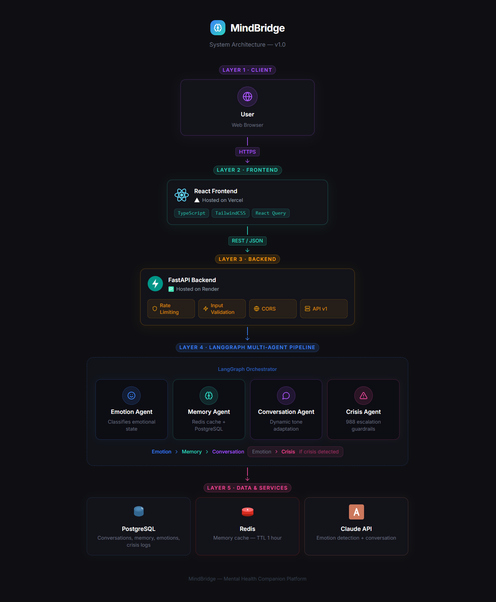

# MindBridge

A memory-driven AI companion for workplace stress — built with FastAPI, PostgreSQL, and Claude API.

## The Problem It Solves

Existing AI companions like Replika, Wysa, and Woebot reset after every session.
MindBridge remembers you across every conversation — your stressors, what helped,
your patterns — solving the core gap every competitor misses.

## Live Demo

- API Base URL: `Self-hosted — see Local Setup below`

> This is an open source project. Clone the repository, add your own
> API keys, and deploy your own instance. See the Local Setup section
> for instructions.

## Architecture



### Agent Pipeline

| Agent | Responsibility |
|---|---|
| Emotion Agent | Classifies message — calm, stressed, anxious, overwhelmed, crisis |
| Memory Agent | Checks Redis cache first, falls back to PostgreSQL, injects context |
| Conversation Agent | Builds dynamic system prompt based on emotion, calls Claude API |
| Crisis Agent | Bypasses normal flow entirely, immediate 988 escalation, no questions asked |

## Tech Stack

- **Backend:** Python, FastAPI, LangGraph
- **Database:** PostgreSQL (Render), Redis (Upstash)
- **AI:** Anthropic Claude API
- **Frontend:** React (Vercel)
- **ORM:** SQLAlchemy
- **Testing:** Pytest — 15 tests passing
- **Security:** API key authentication, CORS locked, rate limiting, input validation

## API Documentation

Base URL: `Available on request`

All endpoints require `X-API-Key` header.

### Endpoints

#### POST /api/v1/chat
Send a message and get a response.

**Request body:**
```json
{
  "user_id": "string (max 50 chars)",
  "session_id": "string (max 100 chars)",
  "message": "string (1-2000 chars)"
}
```

**Response:**
```json
{
  "session_id": "string",
  "reply": "string",
  "emotion_detected": "calm | stressed | anxious | overwhelmed | crisis",
  "crisis_escalated": "boolean",
  "memory_active": "boolean"
}
```

**Error codes:**
- `422` — Validation error (empty message, message too long)
- `429` — Rate limit exceeded (10 requests per minute per IP)
- `403` — Invalid or missing API key

---

#### POST /api/v1/memory/update
Summarize and store user memory from all past conversations.

---

#### GET /api/v1/memory/{user_id}
Retrieve stored memory for a user.

---

#### GET /api/v1/history/{user_id}
Get conversation history with pagination. Query params: `skip=0&limit=50`

---

#### GET /api/v1/patterns/{user_id}
Get AI-generated pattern insights from emotion history.

---

#### GET /api/v1/weekly-summary/{user_id}
Get weekly emotional wellness summary for the past 7 days.

---

#### GET /api/v1/emotions/{user_id}
Get full emotion breakdown and history.

---

#### GET /api/v1/crisis-log/{user_id}
Get crisis event audit log.

---

#### GET /health
System health check — database, Redis, API status.

## Key Design Decisions

**Why persistent memory?**
Every existing competitor resets after each session. MindBridge stores
conversation history per user and injects a summarized memory into every
new session — so the agent remembers your stressors, patterns, and what
helped before.

**Why LangGraph?**
Three specialized agents — emotion, memory, conversation — each with one
responsibility. Clean separation of concerns, independently testable,
easy to extend.

**Why FastAPI?**
Async-ready, Pydantic validation, rate limiting support — production-grade
from day one.

**Why Redis caching?**
Memory retrieval from PostgreSQL takes ~170ms. Redis cache reduces this
to ~33ms — 5x faster on repeat requests.

**Why dual-layer crisis detection?**
Rule-based keyword check runs first (zero latency). LLM classification
runs second for subtle signals. Crisis path bypasses memory and
conversation agents entirely — no questions asked, immediate 988 referral.

## Local Setup

```bash
git clone https://github.com/sai-k21/mindbridge.git
cd mindbridge
uv venv
.venv\Scripts\activate
uv pip install -r requirements.txt
```

Create `.env` file:
```
DATABASE_URL=your_postgresql_url
ANTHROPIC_API_KEY=your_anthropic_key
REDIS_URL=your_redis_url
API_KEY=your_api_key
```

Run:
```bash
uvicorn app.main:app --reload
```

## Testing

```bash
pytest tests/ -v
```

15 tests covering API validation, emotion detection, crisis detection, and endpoint behavior.

## Security

- API key required on all endpoints
- CORS locked to production frontend only
- Rate limiting: 10 requests per minute per IP
- Input validation: messages 1-2000 characters
- No real names or emails stored
- Random session IDs — users are anonymous
- Environment variables never committed to repository

## Roadmap

- [x] Phase 1: FastAPI + PostgreSQL + Claude API
- [x] Phase 2: Persistent memory across sessions
- [x] Phase 3: Emotion detection and tone adaptation
- [x] Phase 4: Pattern recognition and weekly insights
- [x] Phase 5: Crisis detection and guardrails
- [x] Phase 6: Multi-agent orchestration with LangGraph
- [x] Phase 7: Redis caching + observability
- [x] Phase 8: Deployment + React frontend
- [ ] Phase 9: User authentication and accounts
- [ ] Phase 10: End-to-end encryption
```
